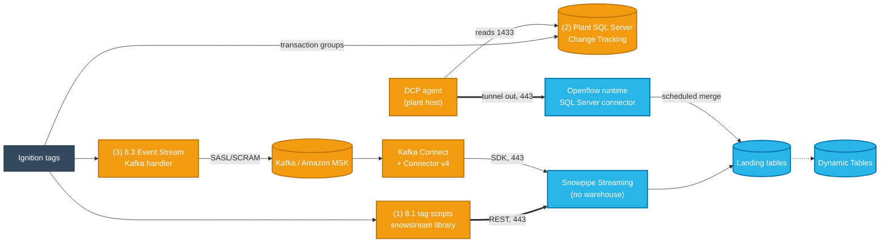

# Ignition SCADA → Snowflake, without a warehouse running all day

Four tested ways to stream tag data from **Inductive Automation Ignition** (8.1 or 8.3) into
**Snowflake**, from "no new software at all" to "Kafka on Amazon MSK". Every path below was run end
to end against a real Snowflake account and survived a network outage with no lost and no duplicated
rows.

## Executive summary

**The problem.** A common first integration has Ignition write each tag change to Snowflake as a
JDBC `INSERT`. The inserts arrive every few seconds, so the warehouse never sits idle long enough to
auto-suspend: an X-Small runs 24 hours a day (24 credits a day on a standard warehouse, 30 to 32 on
Gen2) to receive a few kilobytes at a time.

**The fix.** Land the data with **Snowpipe Streaming**, whose ingest costs almost nothing (0.000083
credits for a 17-hour soak) and needs no warehouse, so what you pay for is a Dynamic Table refresh on a
schedule you set. Or batch the inserts so the warehouse can suspend, or use an Openflow connector.
Which path fits depends mostly on the Ignition version and on what the plant network allows:

| If you have... | Use | Snowflake credits / day (measured) | New Ignition licensing | New infrastructure | Latency |
|---|---|---|---|---|---|
| Any version, and want the bill down without new services | **0. Batch the JDBC writes**: one multi-row `INSERT` every 15 min from a gateway script + 60 s auto-suspend | **2.2** | none | none | up to the batch interval |
| **Ignition 8.1** (or 8.3 without the Kafka module) | **1. Gateway script → Snowpipe Streaming REST** | **2.8** | none | none | ~5–8 s |
| A plant database, and a rule that nothing may be exposed | **2. Plant SQL Server → Openflow via Data Connectivity Proxy** | **14.5** (15-min merge); 34.2 at the default | none | SQL Server, a small Docker host | 1–15 min (merge schedule) |
| **Ignition 8.3 + Kafka module**, or a shared event bus | **3. Event Streams → Kafka / Amazon MSK → Connector v4** | **≤ 2.8**, plus Kafka hosting | Kafka module | Kafka + Kafka Connect | ~5–8 s |

Breakdown per hour, day and month, and where each number was measured: [What it costs](#what-it-costs).

All four send traffic **out** of the plant only; nothing connects in. Paths 1 and 2 work on Ignition
8.1 with no upgrade and no extra modules.

**What we would do first:** path 0 or path 1. Both are a gateway script and cost about the same; path 0
keeps the JDBC connection, path 1 is seconds-fresh and needs no warehouse for ingest. Path 2 if the
security team requires the plant to only ever talk to a local database, and path 3 when there is a
Kafka backbone other systems will share.

## The four paths at a glance

```
 PLANT / EDGE (outbound only)       IN BETWEEN           SNOWFLAKE
                                                      ┌────────────────────┐
(1) Ignition 8.1 tag scripts ── REST, HTTPS 443 ─────►│ Snowpipe Streaming │
    snowstream: batch every 5 s                       │ (no warehouse)     │
                                                      │                    │
(3) Ignition 8.3 Event Stream                         │                    │
    │ SASL/SCRAM                                      │                    │
    ▼                                                 │                    │
  ┌─────────────┐    ┌─────────────────────┐          │                    │
  │ Kafka / MSK │───►│ Kafka Connect + v4  │── 443 ──►│                    │
  └─────────────┘    └─────────────────────┘          └─────────┬──────────┘
                                                                ▼
(2) Ignition 8.1 transaction groups                   ┌────────────────────┐
    │ JDBC                            ┌─ merge (CRON)►│ Landing tables     │
    ▼                                 │               └─────────┬──────────┘
  ┌─────────────┐  ┌───────────┐  ┌───┴──────────┐              ▼ refresh
  │ Plant SQL   │◄─│ DCP agent │═►│ Openflow SQL │    ┌────────────────────┐
  │ Server (CT) │  │ (plant)   │  │ Server conn. │    │ Dynamic Tables     │
  └─────────────┘  └───────────┘  └──────────────┘    └────────────────────┘
               reads 1433   tunnel 443
```

The Openflow runtime runs inside Snowflake (a Snowflake deployment); it reaches the plant database
only back through the DCP agent's outbound tunnel.



Orange runs in the plant or your cloud account; blue is Snowflake. Thick edges cross the plant
boundary, always outbound on port 443. The dotted edge is the scheduled Dynamic Table refresh.

Everything on the Ignition side is plain text in this repo: the 8.3 path loads tags, the Kafka
connection and the Event Stream from Ignition 8.3's file-based configuration, and the 8.1 path builds
a gateway backup from a script library and tag definitions. Both run in Ignition's resettable
2-hour trial, so no license is needed to try them.

## Verified

All runs on 2026-10-01/02 against a Snowflake account in AWS us-east-1; path 1 was also run against
an account in Azure East US 2 (only the account identifier changes; see [docs/ignition81-rest.md](docs/ignition81-rest.md)). The outage test in each row
cut the path for two minutes while Ignition (or the plant database) kept producing, then checked
that every row arrived exactly once. Path 0 was measured on Azure East US 2 only (4-minute cut); path 3 was also run on Azure (row 3c).

| Path | Ran on | Rows checked | Outage test | Result | Freshness |
|---|---|---|---|---|---|
| 0. Batched JDBC | Ignition 8.1.42 trial in Docker, Snowflake JDBC 4.3.3, Azure East US 2 | 4,493 | gateway network disconnected for 4 min across a flush | the failed flush's rows went out with the next one (1,798 rows, one `INSERT`); largest gap 1.08 s, 0 duplicates | up to 15 min |
| 1. 8.1 REST | Ignition 8.1.42 trial in Docker | 600 | gateway network disconnected | largest gap per 1-second tag 1.07 s, 0 duplicate `EVENT_ID`s | 4–8 s |
| 2. Openflow + DCP | SQL Server 2022 + DCP agent in Docker, Openflow MEDIUM runtime (AWS); repeated on Azure East US 2 with a real 8.1.42 gateway: 14,292 rows, 0 missing, 0 duplicate | 9,525 | DCP agent stopped | source key `ndx` 1–9525 contiguous, 0 missing, 0 duplicate | merge schedule (15 min) |
| 3a. Kafka, laptop | Ignition 8.3.9 → Apache Kafka 3.9.1 → Kafka Connect 3.9.1 | 1,648 | Kafka Connect stopped | Kafka offsets contiguous, 0 missing, 0 duplicate | ~5 s |
| 3b. Kafka, AWS | Ignition 8.3.9 on EC2 → Amazon MSK → MSK Connect 3.7.x | 3,047 | 25 min of events buffered in the topic before the connector existed | offsets 0–3046 contiguous, 0 missing, 0 duplicate | ~8 s |
| 3c. Kafka, Azure | Ignition 8.3.9 → Azure Event Hubs (Standard, Kafka endpoint) → Kafka Connect standalone + v4, Snowflake in Azure East US 2 | 6,871 | Kafka Connect stopped | offsets 0–6870 contiguous, 0 missing, 0 duplicate; largest gap 1.10 s | 8–14 s |

**Re-run on a clean account, 2026-10-03/04:** every path above was run again end to end on a fresh
Snowflake account in AWS us-west-2, from a clean clone, then torn down. The 3b stack ran in a shared
AWS account in us-west-2 and 3c used an Event Hubs namespace in Azure West US 2.

| Path | Rows checked | Outage test | Result | Freshness |
|---|---|---|---|---|
| 0. Batched JDBC | 2,694 (multi-row) | gateway network cut 4 min across a flush | next flush wrote 1,797 rows in one `INSERT`; 0 duplicates, largest gap 1.03 s. Credits over ~47 min: store-and-forward 0.632, transaction group 0.091, multi-row 0.046 | up to 15 min |
| 1. 8.1 REST | 568 | gateway network cut 2 min | 0 duplicates, largest gap 2.0 s; bad row → `ERROR_TABLE`, good row in the same request landed; restart during the outage left a 71.7 s gap | ~5 s |
| 2. Openflow + DCP | 1,938 | DCP agent stopped 2 min | `ndx` 1–1938 contiguous, 0 missing, 0 duplicate; agent reconnected `HEALTHY` on its own | merge schedule (15 min) |
| 3a. Kafka, laptop | 608 | Kafka Connect stopped 2 min | offsets 0–607 contiguous, 0 missing | ~5 s |
| 3b. Kafka, AWS | 945 | events buffered before the connector existed | offsets 0–944 contiguous, 0 missing | ~14 s |
| 3c. Kafka, Azure | 857 | Kafka Connect stopped 2 min, restarted with no offsets file | offsets 0–856 contiguous, 0 missing, 0 duplicate; largest gap 1.01 s; bad record → `ERROR_TABLE`, task kept running | 8–15 s |

The re-run found three things the first runs did not: `dcp_setup.sql` was missing a
`CREATE WAREHOUSE` grant, the SQL Server connector's source parameters are named `SQLServer …`, and a
shared AWS account needs the options in [docs/aws-msk.md](docs/aws-msk.md#shared-and-locked-down-accounts).
All three are fixed in this repo.

Each path's own doc has the full record and the SQL that produced these numbers
(`snowflake/verify*.sql`, `openflow-dcp/snowflake/verify.sql`).

## What it costs

Snowflake credits only, measured from `METERING_HISTORY` / `WAREHOUSE_METERING_HISTORY` on test
accounts in October 2026, at the shape this repo runs: three tags, two of them changing every second,
about 7,200 rows an hour. Per day is per hour × 24; per month is per day × 30. Multiply by your
contracted price per credit for dollars. Paths 0 and 1 are near the same cost; path 2 costs about
5 to 7 times either.

| Path | What bills | Credits / hour | Credits / day | Credits / month | Measured on |
|---|---|---|---|---|---|
| Today: continuous JDBC inserts | X-Small warehouse that never suspends | 1.00 (standard) · 1.25 (Gen2, Azure) · 1.35 (Gen2, AWS) | 24 · 30 · 32.4 | 720 · 900 · 972 | warehouse credit rates; this is the floor, since session and commit statements add cloud services |
| **0.** Batched JDBC, one multi-row `INSERT` every 15 min | X-Small Gen2, `AUTO_SUSPEND = 60`, wakes 4 times an hour | **0.09** | **2.2** | **65** | Azure, full hours ([docs/ignition81-batch.md](docs/ignition81-batch.md)) |
| 0, but store-and-forward set to 15 min | same warehouse; still one `INSERT` per reading | 1.01 | 24.2 | 727 | Azure: does **not** save |
| **1.** Ignition 8.1 → Snowpipe Streaming REST | the two Dynamic Tables at a 15-minute lag (X-Small); ingest itself | **0.117** median (0.048–0.144) | **2.8** | **84** | AWS, 17-hour soak on 2026-10-04/05: 1.889 credits warehouse; **0.000083 credits ingest in total** |
| **2.** Openflow + DCP, 15-minute merge | control pool 0.108 + MEDIUM runtime 0.403 + merge warehouse 0.092, all always on | **0.603** | **14.5** | **434** | AWS full hours; Azure control pool + runtime 12.3 a day ([docs/openflow-dcp.md](docs/openflow-dcp.md)) |
| 2, Openflow's default 1-minute merge | same, merge warehouse 0.912 | 1.423 | 34.2 | 1,025 | AWS: **more than today** |
| **3.** Ignition 8.3 → Kafka → Connector v4 | Snowpipe Streaming ingest plus the per-minute Dynamic Table, same as path 1's | ≤ path 1 | ≤ 2.8 | ≤ 84 | not soaked separately; same Snowflake objects as path 1 minus the dedup table. **Plus** Kafka and Kafka Connect hosting and Ignition 8.3 licensing, which are not Snowflake costs |

Notes on the table:

- **Ingest is not the cost.** Snowpipe Streaming bills 0.0037 credits per uncompressed GB
  ([Consumption Table](https://www.snowflake.com/legal-files/CreditConsumptionTable.pdf), October
  2026). The 17-hour soak ingested about 120,000 rows for 0.000083 credits. At a bigger site, 300 tags
  changing every second at 190 bytes an event is about 150 GB a month, or 0.55 credits a month. What
  you pay for is what runs after ingest: the Dynamic Table refresh in paths 1 and 3, the always-on
  Openflow compute in path 2.
- **The lever is the refresh interval.** Path 1's 2.8 credits a day is two Dynamic Tables at a
  15-minute `TARGET_LAG`; a longer lag costs less, a shorter one more. Path 2's merge schedule is the
  same lever (`Merge Task Schedule CRON`), but its control pool and runtime bill whether data moves or not.
- **Cloud services** are in the measured warehouse figures where `METERING_HISTORY` reported them
  (0.035 of the soak's 1.889 credits), and are billed only above 10% of the day's warehouse credits:
  https://docs.snowflake.com/en/user-guide/cost-understanding-compute
- Estimate your own shape with [`scripts/cost_estimate.py`](scripts/cost_estimate.py) (tag count,
  change rate, credit price).

Snowpipe Streaming pricing: https://docs.snowflake.com/en/user-guide/snowpipe-streaming/snowpipe-streaming-high-performance-cost
· Openflow pricing: https://docs.snowflake.com/en/user-guide/data-integration/openflow/cost-spcs
· Warehouse credits per hour: https://docs.snowflake.com/en/user-guide/warehouses-overview

## Prerequisites

Tested on macOS and in a clean Ubuntu 24.04 container (October 2026). Every path needs:

| Tool | Used for | Tested with |
|---|---|---|
| Docker with Compose v2 | Ignition, Kafka, SQL Server and the DCP agent run in containers; `ignition81/make_gwbk.sh` also builds the 8.1 gateway backup by running Ignition in Docker | Docker 29.8, Compose v5.5 |
| [Snowflake CLI](https://docs.snowflake.com/en/developer-guide/snowflake-cli/installation/installation) (`snow`) with a named connection | every `snowflake-setup` / `*-verify` target; set `SNOWFLAKE_CONNECTION` to the connection name | 3.28 |
| python3 (standard library only), curl, openssl, zip | gateway-backup builders, key pair, plugin download, `cost_estimate.py` | Python 3.12 |
| A Snowflake role that can create databases, roles, users, warehouses and network policies | `snowflake-setup`; path 2 also needs `ACCOUNTADMIN` once for section 1 of `dcp_setup.sql` | `ACCOUNTADMIN` |

Path 3b also needs the AWS CLI (plus the Session Manager plugin to reach the gateway UI) and an account where you can create MSK, MSK Connect, IAM roles,
KMS keys, Secrets Manager secrets and EC2 (see [docs/aws-msk.md](docs/aws-msk.md)); path 3c needs the
Azure CLI. Path 2's connector steps use [`nipyapi`](https://github.com/Chaffelson/nipyapi), or the
same steps in the Openflow UI. No Ignition license is needed: every gateway runs as Inductive
Automation's resettable 2-hour trial.

## Path 0: batch the existing JDBC writes

Keep the JDBC connection, but have a gateway script collect readings in memory and write them as one
multi-row `INSERT` every 15 minutes, with the warehouse on a 60-second auto-suspend. Measured on Ignition
8.1.42 against an Azure Gen2 X-Small: **0.09 credits an hour**. Setting the connection's
store-and-forward engine to forward every 15 minutes instead does **not** batch: it still sends one
`INSERT` per reading and measured **1.01 credits an hour**. The test, the two scripts and a builder for
both gateways: [docs/ignition81-batch.md](docs/ignition81-batch.md)

## Path 1: Ignition 8.1 → Snowpipe Streaming REST (no new modules)

```
 PLANT: Ignition 8.1 gateway                        SNOWFLAKE
┌──────────────────────────────────────┐
│ Tag "Value Changed" script           │
│  snowstream.enqueue(tag, value)      │
│  ▼                                   │
│ In-memory buffer (bounded)           │    ┌──────────────────────┐
│  ▲ every 5 s: _Flush tag             │    │ Account host         │
│  │ 1. sign JWT (RSA key) ────────────┼443►│ hostname + scoped    │
│  │ 2. scoped token, cached ~50 min ◄─┼────┤ OAuth token          │
│  │ 3. POST gzip NDJSON batch ────────┼443►│ Ingest host          │
│  │ 4. 200 → drop from buffer       ◄─┼────┤ Snowpipe Streaming   │
│  │    error → keep, retry next tick  │    └──────────┬───────────┘
└──────────────────────────────────────┘               ▼
                                         SCADA_TAG_EVENTS_REST → _DEDUP (DT)
```

A Jython script library (`ignition81/project/.../snowstream/code.py`, standard library only) buffers
tag changes and posts them every 5 seconds. Rows leave the buffer only after HTTP 200, so outages are
retried; a retry after an ambiguous reply can land a row twice, and a Dynamic Table keeps one row per
`EVENT_ID`. **Trade-off:** the buffer is in gateway memory, so a gateway restart during a Snowflake
outage loses what was queued.

```bash
cp local/.env.example local/.env      # passwords, Snowflake account
make snowflake-setup rest-setup       # service user, landing table, dedup DT
make rest-up                          # Ignition 8.1.42 trial on :8081
make rest-verify                      # wait ~90 s after rest-up: earlier, it shows 0 rows while the gateway boots
```

Detail, sequence diagram, installing on a real gateway and gotchas: [docs/ignition81-rest.md](docs/ignition81-rest.md)

## Path 2: Plant SQL Server → Openflow via Data Connectivity Proxy

```
 PLANT (no inbound rules)                        SNOWFLAKE
┌───────────────────┐  JDBC  ┌─────────────────┐
│ Ignition 8.1      │───────►│ SQL Server      │
│ transaction groups│        │ Change Tracking │
└───────────────────┘        └────────▲────────┘
                                      │ 1433
                             ┌────────┴────────┐       ┌───────────────────┐
                             │ DCP agent       │═443══►│ Data Connectivity │
                             │ dials out only  │tunnel │ Proxy → Openflow  │
                             └─────────────────┘       │ SQL Server conn.  │
                                                       └─────────┬─────────┘
                                               journal ─► merge (CRON)
                                                                 ▼
                                                       IGNITION_DBO.LINE1_TG
```

Ignition keeps writing over JDBC, but to a SQL Server in the plant instead of to Snowflake. A small
agent on a plant host opens an outbound tunnel on 443, and Openflow on a Snowflake deployment
replicates the tables through it. **Trade-off:** about 14.5 credits a day with a 15-minute merge
against path 1's 2.8, because the Openflow control pool and runtime run continuously, and it adds a
database and an agent host; in return nothing is exposed, and the plant database buffers through any
outage (13 hours on a new account, 0 rows lost).

Runnable plant stack (SQL Server, a transaction-group simulator, the DCP agent) in
[`openflow-dcp/`](openflow-dcp/); Snowflake setup in `openflow-dcp/snowflake/dcp_setup.sql`; the
gateway-side steps for a real 8.1 gateway in [openflow-dcp/ignition-81.md](openflow-dcp/ignition-81.md).
Detail and gotchas: [docs/openflow-dcp.md](docs/openflow-dcp.md)

## Path 3: Ignition 8.3 → Kafka / Amazon MSK → Connector v4

```
 PLANT / CLOUD                                       SNOWFLAKE
┌───────────────────────────┐ SASL/SCRAM ┌─────────────┐
│ Ignition 8.3 Event Stream │───────────►│ Kafka topic │
│ tag source → transform    │ TLS on MSK │ (or MSK)    │
│ → batch → Kafka handler   │            └──────┬──────┘
└───────────────────────────┘                   ▼
                              ┌────────────────────────┐ SDK 443 ┌──────────┐
                              │ Kafka Connect or MSK   │────────►│ Snowpipe │
                              │ Connect + Connector v4 │         │ Streaming│
                              └────────────────────────┘         └────┬─────┘
                                                                      ▼
                                      SCADA_TAG_EVENTS → SCADA_TAG_MINUTE (DT)
```

Ignition 8.3's Event Streams publish tag changes to Kafka; the Snowflake Connector for Kafka v4 lands
them with Snowpipe Streaming, exactly once per Kafka offset. The topic is the buffer, so outages on
either side of it lose nothing. **Trade-off:** you run Kafka and Kafka Connect, and 8.3 needs the
Kafka module.

| Mode | What runs | Start here |
|---|---|---|
| Laptop (`local/`) | Ignition + Apache Kafka (KRaft) + Kafka Connect in Docker | below |
| AWS (`aws/`) | Ignition on EC2 → Amazon MSK (SCRAM for Ignition, IAM for Connect) → MSK Connect | [docs/aws-msk.md](docs/aws-msk.md) |
| Azure | Event Hubs + self-run Connect (tested), or Confluent Cloud custom connector (not run) | [docs/azure-variant.md](docs/azure-variant.md) |

```bash
cp local/.env.example local/.env   # passwords, Snowflake account
make snowflake-setup    # table, DT, role, key-pair user, network policy
make local-up           # Kafka, Ignition on :8088, Connect + connector
make local-verify       # rows, freshness, Kafka offset gap check (give it ~90 s after local-up)
```

`make snowflake-setup` uses the Snowflake CLI (`snow`) with the connection in `SNOWFLAKE_CONNECTION`
and a role that can create databases, roles, users, warehouses and network policies. If you would rather
not use `ACCOUNTADMIN`, these grants are enough for every `*-setup` and `*-teardown` target in paths 0
and 1 (tested 2026-10-04 with a role holding nothing else):

```sql
CREATE ROLE IGNITION_SETUP_ADMIN;
GRANT CREATE DATABASE, CREATE ROLE, CREATE USER, CREATE WAREHOUSE, CREATE NETWORK POLICY
  ON ACCOUNT TO ROLE IGNITION_SETUP_ADMIN;
GRANT ROLE IGNITION_SETUP_ADMIN TO USER <you>;
```

`make snowflake-teardown` drops the schema, not the database, so the default `SNOWFLAKE_EXAMPLE`
is never removed. If you set `SNOWFLAKE_DATABASE` to a database of your own, drop it yourself
afterwards. `SNOWFLAKE_ALLOWED_IP` is the egress IP
of wherever the connector runs; the service user gets a user-level network policy allowing only that.

## Things that will bite you

All of these were hit while building this repo.

**Any path**

1. **Pre-create landing tables with explicit types and UPPERCASE keys.** Snowpipe Streaming preserves
   identifier case and infers types from the first records it sees.
2. **The connector's egress IP must be on the service user's network policy.** On AWS, a VPC's NAT can
   be private; find the real egress IP from inside the VPC.

**Path 1 (REST)**

3. **Use the dash form of the account host** (`my-org-my-account.snowflakecomputing.com`); the
   underscore form fails TLS hostname verification. More in [docs/ignition81-rest.md](docs/ignition81-rest.md).

**Path 2 (Openflow + DCP)**

4. **Set `Merge Task Schedule CRON`.** By default the connector merged every minute, so its warehouse
   never suspended. A 15-minute schedule let it suspend between merges with no rows lost.
5. **The SQL Server connector needs a MEDIUM runtime**, and runtime size cannot be changed later.
6. **The integration goes in two places**: on the runtime and on the proxy object. Missing either
   gives a plain connection failure. More in [docs/openflow-dcp.md](docs/openflow-dcp.md).

**Path 3 (Kafka + v4)**

7. **Kafka Connect must run on glibc.** v4's native Snowpipe Streaming SDK fails on Alpine images such
   as `apache/kafka` with `Error loading shared library libgcc_s.so.1`.
8. **The plugin needs three Bouncy Castle FIPS jars** next to the connector jar
   (`connect/plugin-jars.txt` pins all four), or tasks fail with `ClassNotFoundException`.
9. **Fresh installs must set `snowflake.streaming.validate.compatibility.with.classic=false`.**
   https://docs.snowflake.com/en/user-guide/kafka-connector/migrate-v3-to-v4
10. **Ignition cannot use MSK's IAM auth.** Its Kafka client has SCRAM but not `AWS_MSK_IAM`; run MSK
    with SCRAM for Ignition and IAM for MSK Connect ([docs/msk-auth.md](docs/msk-auth.md)). On MSK
    Connect, pick Kafka Connect 3.7.x (Java 17).
11. **Seed Ignition 8.3 config into the `external` resource collection**, not `core`, and put atomic
    tags in a folder's `tags.json`. Keep the Kafka password out of the connection config: set the
    connection's `password` to a `Referenced` secret in Ignition's file secret provider (8.3.5+),
    not `sasl.jaas.config` in client properties, which stores it in plain text.
12. **v4 remembers Kafka offsets in Snowflake.** Recreate the topic and its records (starting again at
    offset 0) are skipped. Run `make snowflake-reset`, or give the connector a new name.
13. **Turn on table error logging, and pair it with `errors.tolerance=all`.** Without
    `ERROR_LOGGING = TRUE` on the target table, v4 warns that rows the server rejects "will be silently
    dropped". With it,
    a rejected row lands in `ERROR_TABLE(<table>)`, but with `errors.tolerance=none` the task then stops
    (`Channel error count threshold exceeded`) until someone restarts it. Tested on Azure with a string in
    the FLOAT `VALUE` column: with `all`, both bad records went to the error table and good rows kept
    landing with contiguous offsets. `snowflake/setup*.sql` sets the property. Note that v4 4.2.0 still logs
    the "does not have ERROR_LOGGING enabled" warning with it on; the error table is what to check.
    Path 1 is the same: the REST API returned HTTP 200 for a request holding one good and one bad row,
    the good row landed and the bad one went to `ERROR_TABLE(SCADA_TAG_EVENTS_REST)`. The gateway
    log shows nothing, so watch the error table.
    https://docs.snowflake.com/en/user-guide/snowpipe-streaming/snowpipe-streaming-error-tables

Symptom-to-fix table: [docs/troubleshooting.md](docs/troubleshooting.md)

## What is in the repo

```
ignition81/     Path 1: snowstream script library + 8.1 gateway-backup builder
openflow-dcp/   Path 2: plant stack (SQL Server, simulator, DCP agent) + SQL
ignition/       Path 3: Ignition 8.3 image + file-based config
local/          Path 3 laptop mode (compose), and path 1's compose file
connect/        Kafka Connect image with Connector v4 (checksum-pinned)
aws/            Path 3 on AWS: CloudFormation + MSK Connect scripts
snowflake/      setup / verify / teardown SQL for paths 1 and 3
scripts/        key pair, connector registration, cost estimator
docs/           per-path detail, MSK auth, Azure, troubleshooting
blog/post.md    the write-up
```

## References

- Snowpipe Streaming (high-performance): https://docs.snowflake.com/en/user-guide/snowpipe-streaming/snowpipe-streaming-high-performance-overview
- Snowpipe Streaming REST API: https://docs.snowflake.com/en/user-guide/snowpipe-streaming/snowpipe-streaming-high-performance-rest-api
- Snowflake Connector for Kafka (v4): https://docs.snowflake.com/en/user-guide/kafka-connector/index
- Openflow with Data Connectivity Proxy: https://docs.snowflake.com/en/user-guide/data-integration/openflow/setup-openflow-spcs-dcp
- Openflow SQL Server connector: https://docs.snowflake.com/en/user-guide/data-integration/openflow/connectors/sql-server/setup
- Dynamic Tables: https://docs.snowflake.com/en/user-guide/dynamic-tables/overview
- Ignition Event Streams: https://www.docs.inductiveautomation.com/docs/8.3/ignition-modules/event-streams
- Ignition Kafka module: https://docs.inductiveautomation.com/docs/8.3/ignition-modules/cloud-connector-modules/kafka
- Ignition Docker image: https://hub.docker.com/r/inductiveautomation/ignition
- MSK Connect custom plugins: https://docs.aws.amazon.com/msk/latest/developerguide/msk-connect-plugins.html

## Repository owner

- **Owner:** John Kang (john.kang@snowflake.com, [@sfc-gh-jkang](https://github.com/sfc-gh-jkang))
- **Questions or access:** email the owner, or open an issue

## License

The code in this repository is Apache-2.0. It does not include or redistribute any third-party
software; the containers are pulled from their publishers when you run them, under their own terms:

- **Ignition** (`inductiveautomation/ignition`) is licensed by Inductive Automation under its
  [Software License Agreement](https://inductiveautomation.com/ignition/license). The Dockerfile and
  compose files here set `ACCEPT_IGNITION_EULA=Y`, so starting them accepts that agreement on your
  behalf: read it first. Unlicensed gateways run in Ignition's 2-hour trial mode.
- **SQL Server** (`mcr.microsoft.com/mssql/server`, path 2) runs as the Developer edition
  (`MSSQL_PID=Developer`), which is licensed for development and test, not production. The compose
  file sets `ACCEPT_EULA=Y`, accepting Microsoft's license for that image:
  https://learn.microsoft.com/en-us/sql/linux/quickstart-install-connect-docker

This is a sample, not a supported product. It is not affiliated with or endorsed by Inductive
Automation, Microsoft, Amazon or the Apache Software Foundation. Ignition is a trademark of Inductive
Automation; Apache Kafka is a trademark of the Apache Software Foundation; other names are trademarks
of their owners.
