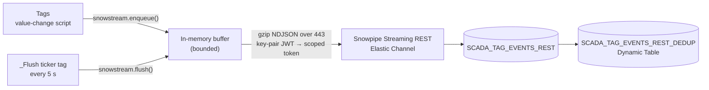

# Ignition 8.1: stream straight to Snowflake over HTTPS, no new modules

For gateways that are not on 8.3, or that don't have the Kafka module, the gateway can post tag
changes directly to the **Snowpipe Streaming REST API**. The traffic is outbound HTTPS on port 443
to Snowflake. There is no Kafka, no Kafka Connect, no Openflow and no extra Ignition module, and
ingestion uses no warehouse.



REST API reference: https://docs.snowflake.com/en/user-guide/snowpipe-streaming/snowpipe-streaming-high-performance-rest-api
Elastic Channels tutorial: https://docs.snowflake.com/en/user-guide/snowpipe-streaming/snowpipe-streaming-elastic-channels-rest-getting-started

## What runs where

| Piece | Where | Notes |
|---|---|---|
| `snowstream` script library | `ignition81/project/ignition/script-python/snowstream/code.py` | Jython 2.7 plus the Java standard library only. Signs the RS256 JWT, exchanges it for a scoped token, gzips NDJSON, retries |
| Tag value-change scripts | on each streamed tag | One line: `snowstream.enqueue(tagPath, currentValue, initialChange)` |
| `_Flush` ticker tag | expression tag every 5 s | Its value-change script calls `snowstream.flush()` |
| Gateway scripting project | `ScadaToSnowflakeRest` | Lets tag scripts import the project library |

In 8.1, tags live in the gateway's internal database and gateway event scripts are stored as
binary, so neither can be committed as text. `ignition81/make_gwbk.sh` takes a stock backup from a
throwaway 8.1 container, and `build_gwbk.py` adds the project, tags and scripts to it. The demo
container restores it at start with `-r`. Everything committed is plain text.

## Run it

```bash
make keys snowflake-setup     # if not done already (service user, role, network policy)
make rest-setup               # landing table + dedup Dynamic Table
make rest-up                  # build the gateway backup, start Ignition 8.1.42 on :8081
make rest-verify              # rows, duplicates, freshness, largest gap per tag
make rest-down
```

`local/.env` needs `SNOWFLAKE_ACCOUNT` (the org-account identifier used in the JWT) in addition to
the settings the Kafka mode uses.

## How it works, in detail

The README has the diagrams and the short version:
[How the Ignition 8.1 mode works](../README.md#path-1-ignition-81--snowpipe-streaming-rest-no-new-modules). This section is the
long version, following one tag reading from the PLC to the deduplicated table.

### At gateway start

- The demo container starts Ignition 8.1.42 with `-r /restore.gwbk`, which restores the backup built by
  `make_gwbk.sh`. That backup carries the `ScadaToSnowflakeRest` project (the `snowstream` script
  library), the `LineSim` tags with their scripts, and the setting that makes `ScadaToSnowflakeRest` the
  **Gateway Scripting Project**. Tag scripts run in the gateway, and that setting is what lets them call
  `snowstream.*`.
- No connection to Snowflake is opened at start. The first one is made on the first flush.
- On a real gateway you skip the backup and do the equivalent in the Designer (see below).

### One reading, end to end

| Step | Where | What happens |
|---|---|---|
| 1 | Tag | `[default]LineSim/Line1/Temperature` changes value (here an expression; in a plant, an OPC/PLC tag) |
| 2 | Tag script | `snowstream.enqueue(tagPath, currentValue, initialChange)` runs. The initial value on gateway start is skipped |
| 3 | `enqueue()` | Builds one JSON object: `EVENT_ID` (tag path, a pipe character, then the source timestamp in ms), `SITE`, `LINE`, `TAG_PATH`, `VALUE` (booleans become 1.0/0.0), `QUALITY`, `EVENT_TS_MS`. Adds it to a `ConcurrentLinkedQueue` kept in gateway globals, so it survives script reloads |
| 4 | Ticker | `_Flush` changes every 5 s; its script calls `snowstream.flush()`. If the previous flush is still running, this one returns immediately |
| 5 | Auth | If no token is cached, or it is over 50 minutes old: sign an RS256 JWT with the PKCS#8 key (`java.security`), call `GET /v2/streaming/hostname` on the account host, then `POST /oauth/token` with `scope=<ingest host>`. Cache the scoped token and ingest host |
| 6 | Send | Join the buffered rows as NDJSON, gzip them, `POST https://<ingest host>/v2/streaming/data/databases/<DB>/schemas/<SCHEMA>/tables/<TABLE>/rows?requestId=<uuid>&retryCount=<n>` |
| 7 | Result | HTTP 200: remove exactly those rows from the buffer. 401: drop the cached token and retry. Anything else, or a network error: up to 3 attempts with the same `requestId` and 1/2/4 s back-off, then leave the rows for the next tick |
| 8 | Snowflake | On the first append Snowflake creates the managed pipe `SCADA_TAG_EVENTS_REST-STREAMING`. Rows are committed by Snowpipe Streaming, with no warehouse, typically within a few seconds of the 200 |
| 9 | Dedup | `SCADA_TAG_EVENTS_REST_DEDUP` (Dynamic Table, 15-minute lag) keeps one row per `EVENT_ID` |

### What happens when things go wrong

| Situation | Behaviour |
|---|---|
| Plant loses internet / Snowflake unreachable | Rows accumulate in the buffer and are sent on the first tick after connectivity returns. Verified with a 2-minute cut: no gap, no duplicates |
| Outage long enough to fill the buffer | Above `SNOWSTREAM_MAX_BUFFER` rows (default 100,000), the oldest are dropped and the count is logged as a warning |
| Gateway restarts while rows are buffered | Those rows are lost. The buffer is in memory. Measured: a restart 60 s into an outage left a 70.5 s gap (buffer plus boot time) |
| Snowflake accepts a request but the reply is lost | The batch is resent, so some rows land twice; the Dynamic Table removes them |
| A row has the wrong type (e.g. a string in the FLOAT `VALUE` column) | Snowflake still answers HTTP 200 and the good rows in the same request land, so the gateway cannot see it. With `ERROR_LOGGING = TRUE` (set by `snowflake/setup_rest.sql`) the bad row lands in `ERROR_TABLE(SCADA_TAG_EVENTS_REST)` with the cast error. Tested on Azure. Check that table, not the gateway log |
| Key rotated or user disabled | Hostname/token calls fail with 401 and the rows stay buffered; warnings appear in the gateway log under the `snowstream` logger |

Each request carries at most 4 MB of uncompressed NDJSON, so it is always under the 4 MB limit even
before gzip. A flush loops until the buffer is empty, so a backlog after an outage drains in one tick.

## Putting it on a real 8.1 gateway

No restore needed. In the Designer:

1. Create a project library script named `snowstream` and paste in `code.py`.
2. Set that project as the **Gateway Scripting Project** (Config → Gateway Settings).
3. On each tag to stream, add a Value Changed event script:
   `snowstream.enqueue(tagPath, currentValue, initialChange)`.
4. Add an expression tag `toMillis(now(5000))` with a Value Changed script `snowstream.flush()`
   (or call `snowstream.flush()` from a Gateway Timer Script every 5 seconds).
5. Put the private key file on the gateway host, and set `SNOWFLAKE_ACCOUNT`, `SNOWFLAKE_USER`,
   `SNOWFLAKE_DATABASE`, `SNOWFLAKE_SCHEMA`, `SNOWFLAKE_TABLE` and `SNOWFLAKE_PRIVATE_KEY_FILE` as
   environment variables of the gateway service, or hard-code all but the key path at the top of the
   script.

Allow outbound 443 from the gateway to two hosts: the account URL
(`<org>-<account>.snowflakecomputing.com`) and the ingest host it returns. Add the gateway's egress IP
to the service user's network policy. The ingest host is a different name under
`.snowflakecomputing.com` (on the Azure test account, `<account locator>.ingest.<short code>.snowflakecomputing.com`),
and `SYSTEM$ALLOWLIST()` does not list it (checked 2026-10-03), so a firewall that allows Snowflake by
exact hostname needs it added. Get it with `GET https://<account URL>/v2/streaming/hostname`, sending
the key-pair JWT and `Accept: application/json`.

## Verified

2026-10-02, Ignition 8.1.42 trial in Docker against a Snowflake account in AWS us-east-1:

- Rows queryable about 5–8 seconds after the tag changed.
- Network outage test: the container was disconnected for 2 minutes and reconnected. Buffered rows
  landed after reconnect, with **no gap** in the 1-second series and **no duplicate** `EVENT_ID`s.
- Clean start through `make rest-up`: 190 rows, 0 duplicates in the first 90 seconds.
- Re-run from an empty table the same day: the gateway's Docker network was disconnected for 2 minutes
  and reconnected. 600 rows, 0 duplicate `EVENT_ID`s, largest gap per 1-second tag 1.07 s, newest row
  4 seconds behind after the catch-up.
- **Azure**, same day, same gateway, against a Snowflake account in Azure East US 2 (only the
  account identifier changes): 199 rows in the first 90 seconds, 0 duplicates, 9 seconds behind, largest
  gap per 1-second tag 1.08 s.
- **Gateway restart during an outage** (Azure account): network cut at 21:06:24 UTC, gateway restarted
  60 s later while still offline, network back at 21:07:46. The 1-second Speed series has one gap of
  **70.5 s** (21:06:23 to 21:07:33): the 60 s held in memory plus the ~10 s the gateway took to boot.
  Rows produced after the restart, while still offline, were buffered and delivered; 0 duplicates.
  This is the measured cost of the in-memory buffer.
- **Re-run on a clean account**, 2026-10-03, against a Snowflake account in AWS us-west-2: 208 rows,
  then 568 after a 2-minute network cut, 0 duplicates, largest gap per 1-second tag 2.0 s, 5 seconds
  behind. A request with one good and one bad row (a string in a FLOAT column) returned HTTP 200: the
  good row landed and the bad one was in `ERROR_TABLE`. The dedup Dynamic Table matched the raw count
  (860 = 860). A gateway restart during an outage left a 71.7 s gap, in line with the 70.5 s above.

## Things that bit while building this

1. **Use the dash form of the account host.** `my_org-my_account.snowflakecomputing.com` fails TLS
   hostname verification; `my-org-my-account.snowflakecomputing.com` works. The docs say this for the
   ingest host; it applies to the control host too.
2. **`GET /v2/streaming/hostname` returned plain text**, not the JSON object the reference page shows.
   The script accepts both.
3. **Send `Accept: application/json`.** Ignition's HTTP client sends no Accept header, and Snowflake
   answers `391902 Unsupported Accept header null`.
4. **Don't use `system.net.httpClient` for the append.** Snowflake accepted the request, then the
   client threw `no statuscode in response`. The rows stayed queued and were resent on every tick,
   which produced up to 40 copies of each row. `java.net.HttpURLConnection` does not have this problem.
   Also catch `java.lang.Throwable`: Java exceptions are not caught by Jython's `except Exception`.
5. **Delivery is at least once.** Keep `EVENT_ID` in every row and read from the dedup Dynamic Table.
6. **Docker Compose prefers exported shell variables to `--env-file`.** If your shell already exports
   `SNOWFLAKE_ACCOUNT` for another project, the container gets the wrong account and the JWT is rejected
   (`390144 JWT token is invalid`). The Makefile sources `local/.env` before calling compose.

## Limits to be aware of

- The buffer is in gateway memory (bounded by `SNOWSTREAM_MAX_BUFFER`, oldest dropped first). A gateway
  restart during a Snowflake outage loses what was buffered. For longer outages, Ignition's Store and
  Forward with the existing JDBC path, or Kafka (8.3 mode), are durable.
- Each request is limited to 4 MB after compression. `flush()` splits large backlogs into several
  requests.
- This is direct use of the REST API. Snowflake recommends its SDKs where they fit; on an 8.1 gateway
  (Jython 2.7) they don't, which is the case the REST API exists for.
