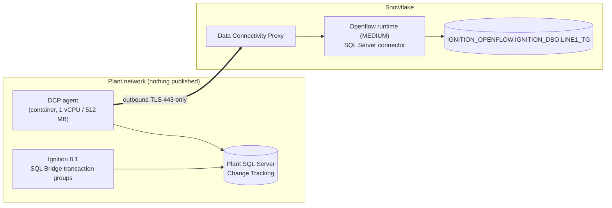

# Openflow on a Snowflake deployment with Data Connectivity Proxy

Openflow can pull plant data into Snowflake without any inbound firewall rule. A small **Data
Connectivity Proxy (DCP)** agent runs in the plant network and opens an outbound TLS tunnel to
Snowflake on port 443. The Openflow runtime runs in Snowflake and reaches plant sources back through
that tunnel. https://docs.snowflake.com/en/user-guide/data-integration/openflow/setup-openflow-spcs-dcp



Snowflake never opens a connection into the plant. The agent dials out, and the runtime's traffic to
`sqlserver.plant.local:1433` rides back through that tunnel. The runtime and the data processing stay
in Snowflake; only the agent runs on site.

## When it fits

- Ignition already writes, or can write, to a plant database that Openflow has a connector for: SQL
  Server, PostgreSQL, MySQL or Oracle. Openflow has no Ignition or OPC UA connector, so the database is
  the source. On Ignition 8.1 that means pointing SQL Bridge transaction groups at a local SQL Server
  instead of at Snowflake ([openflow-dcp/ignition-81.md](../openflow-dcp/ignition-81.md)).
- No new Ignition licensing.
- You want connectors managed in Snowflake, and several plant sources behind one proxy.

## Run it

Everything plant-side runs from `openflow-dcp/docker-compose.yml`: SQL Server 2022 with Change
Tracking, a simulator writing transaction-group-shaped rows (standing in for the gateway), and the DCP
agent. The Snowflake side is `openflow-dcp/snowflake/dcp_setup.sql`.

```bash
# Snowflake: sections 1-3 of the setup script (roles, deployment, DCP object, rule, EAI)
snow sql -c <conn> -f openflow-dcp/snowflake/dcp_setup.sql     # or run it section by section

# Plant: bootstrap token written straight to a 0600 file (never printed), then the stack
make dcp-token
cp openflow-dcp/.env.example openflow-dcp/.env                  # set the two SQL passwords
docker compose -f openflow-dcp/docker-compose.yml --env-file openflow-dcp/.env up -d

# Connector: deploy sqlserver-multidatabase, set 7 parameters, upload the JDBC driver, start
#   (nipyapi steps below)
snow sql -c <conn> --role OPENFLOW_ADMIN -f openflow-dcp/snowflake/verify.sql
```

The SQL Server connector is a NiFi-flow connector. It was deployed and configured with `nipyapi`
against the runtime's NiFi API (authenticating with a PAT restricted to the Openflow admin role):

| Step | Call |
|---|---|
| Deploy | `nipyapi ci deploy_flow --registry_client ConnectorFlowRegistryClient --bucket connectors --flow sqlserver-multidatabase` |
| Parameters | `ci.configure_inherited_params` (connector 0.55.0 names: `SQLServer Connection URL`, `SQLServer Username`, `SQLServer Password`): connection URL `jdbc:sqlserver://sqlserver.plant.local:1433;databaseName=IGNITION;encrypt=false`, username, password, `Included Table Names = IGNITION.dbo.LINE1_TG`, destination database, role and warehouse |
| JDBC driver | `ci.upload_asset --param_name "SQLServer JDBC Driver"` with `mssql-jdbc-12.10.0.jre11.jar` from Maven Central |
| Verify, start | `ci.verify_config`, then `ci.start_flow` |

The same steps work in the Openflow UI.

## Verified

Run on 2026-10-02 on an AWS us-east-1 Snowflake account, with the plant stack
on a laptop behind a corporate network and no port published:

| Check | Result |
|---|---|
| `DESCRIBE DATA CONNECTIVITY PROXY` | `agent_health = HEALTHY`, `DCP_AGENT_LIFECYCLE_CONNECTED`, `data_path_status = DCP_AGENT_DATA_PATH_HEALTHY`, `reachable_destinations = ["sqlserver.plant.local:1433"]` |
| `SYSTEM$VERIFY_EAI_NETWORK_ACCESS` | `allowed: true`, matched the DCP-mode rule |
| Agent log | `connection established`, destination `sqlserver.plant.local:1433`, workload = the Openflow runtime |
| Connector | 85 processors running, 0 invalid, 0 bulletin errors |
| Data | snapshot then incremental; `verify.sql`: contiguous `NDX` from 1, **0 missing, 0 duplicates**, 30–60 s behind the source |
| Agent outage | DCP agent container stopped for 2 minutes: Snowflake reported `DCP_AGENT_LIFECYCLE_DISCONNECTED` / `DOWN`; on restart it reconnected `HEALTHY` on its own, and after the next merge `NDX` 1–9525 was contiguous with 0 missing and 0 duplicates, covering the outage window. The plant database held the rows meanwhile |

**Clean account, 2026-10-03/04.** Run again from a clean clone on a fresh Snowflake account in AWS
us-west-2: deployment, MEDIUM runtime and DCP from `dcp_setup.sql`, plant stack from the compose file,
connector `sqlserver-multidatabase` 0.55.0 through nipyapi with a 15-minute merge. The agent connected
on its first start (`DCP_AGENT_BOOTSTRAP_SUCCEEDED`, certificates requested about 30 minutes before).
85 processors running, 0 invalid. `verify.sql`: `NDX` 1–1152, 0 missing, 0 duplicates, 77 s behind.
The agent was stopped 00:31:25–00:33:29 UTC: Snowflake reported `DCP_AGENT_LIFECYCLE_DISCONNECTED` /
`DOWN`, then `CONNECTED` / `HEALTHY` after restart with no action; after the next merge `NDX` 1–1938 was
contiguous, 0 missing, 0 duplicates. Then torn down. This run is what found
the missing `CREATE WAREHOUSE` grant (now in section 1) and the connector's real parameter names.

**Clean account, real gateway, 2026-10-04.** `dcp_setup.sql` run unmodified as one file, with the
`CREATE WAREHOUSE` grant revoked from `OPENFLOW_ADMIN` beforehand to prove section 1 now covers it:
every statement succeeded and the runtime came up `ACTIVE`. Token from `make dcp-token`, plant from
`make dcp-up-gateway` (a real Ignition 8.1.42 gateway writing through its own SQL Server connection).
85 processors running, 0 invalid. After the snapshot `NDX` 1–73, after the 12:00 UTC merge 1–872,
both contiguous with 0 missing and 0 duplicates. Then `make dcp-down` and `make dcp-teardown`.

**Azure.** The same day the whole path was run again against a Snowflake account in Azure East US 2,
this time with a real Ignition 8.1.42 gateway (`make dcp-up-gateway`) writing the rows through its own
SQL Server connection, and a 15-minute merge schedule (`0 0/15 * * * ?`). `verify.sql` at 02:28 UTC:
`NDX` 1–14292 contiguous, **0 missing, 0 duplicates**; `DESCRIBE DATA CONNECTIVITY PROXY` reported
`HEALTHY` and `DCP_AGENT_DATA_PATH_HEALTHY`, with the agent tunnelling to the account's East US 2 proxy
host. Nothing in the setup SQL changed between clouds.

**Least-privilege role and SQL Server Express (2026-10-04, AWS us-west-2).** Sections 2-5, the
connector, `verify.sql` and `make dcp-teardown` were run as a new user holding only `OPENFLOW_ADMIN`
with exactly the section 1 grants. The plant database was switched to `MSSQL_PID: Express` and
reported `Express Edition (64-bit)`; Change Tracking works on every SQL Server edition
(https://docs.snowflake.com/en/user-guide/data-integration/openflow/connectors/sql-server-cdc/compare-change-tracking-cdc),
but Express caps a database at 10 GB
(https://learn.microsoft.com/en-us/sql/sql-server/editions-and-components-of-sql-server-2022), so
plan a purge job. With the real 8.1.42 gateway: `NDX` 1-1660 contiguous, 0 missing, 0 duplicates,
including a 5-minute agent outage. That run found three fixes now in the scripts: the teardown used
`ACCOUNTADMIN` for objects `OPENFLOW_ADMIN` owns, `verify.sql` assumed a default warehouse, and on a
brand-new account the first deployment took about 13.5 minutes and the first runtime about 15
minutes to come up, past the old waits.

Latency is set mostly by the connector's merge schedule (`Merge Task Schedule CRON`) and the
SQL Server poll interval, not by the tunnel.

## Things that will bite you

1. **Issue per-account certificates first, then wait.** `SELECT SYSTEM$ISSUE_PER_ACCOUNT_CERTIFICATES();`
   must run before the agent can connect, and issuance is asynchronous (documented as at least 30
   minutes; about 20 minutes on an account that already had Openflow, and **more than 3 hours, still
   not issued, on a brand-new Enterprise account** on 2026-10-04). Until then the agent loops on
   `CP connect failed (CP gRPC not ready?) ... transport error`, and a TLS probe of the `dcp.` hostname
   shows a certificate that does not match it (`curl` reports `ssl_verify_result` 1). The agent recovers
   on its own once the certificate exists; no restart is needed. On a new account, request the
   certificates the day before you need the agent.
   https://docs.snowflake.com/en/user-guide/data-connectivity-proxy-setup
   **The same log line appears behind TLS inspection**, and there waiting never helps. Tested
   2026-10-04: an agent whose DCP hostnames resolved to an intercepting proxy looped on it, while the
   same agent with the same token, not intercepted, connected in seconds. If the certificate probe
   above verifies but the agent still loops, check for a proxy or inspection device on the path; DCP
   supports neither: https://docs.snowflake.com/en/user-guide/data-connectivity-proxy-security
2. **The SQL Server connector needs a MEDIUM runtime or larger**, and runtime size cannot be changed
   after creation. Create it MEDIUM the first time.
3. **Runtimes and deployments are terminated, not dropped.** `DROP` fails with `513216: DROP not
   allowed while ... is in <ACTIVE|SUSPENDED> status`. Run `ALTER OPENFLOW RUNTIME ... TERMINATE CASCADE`
   (irreversible), wait for `TERMINATED`, then `DROP`; the deployment works the same way with
   `ALTER OPENFLOW DEPLOYMENT ... TERMINATE`. A suspended runtime's pool scales to zero, so a
   wrong-size runtime costs nothing while you create the right one next to it.
4. **The EAI goes in two places:** on the runtime (`EXTERNAL_ACCESS_INTEGRATIONS`) and on the proxy
   object (`ALTER DATA CONNECTIVITY PROXY ... SET EXTERNAL_ACCESS_INTEGRATIONS`). Missing the second
   gives a plain connection failure.
5. **The network rule takes a hostname, not an IP,** and it must match the connector URL exactly. The
   agent, not Snowflake, resolves it, so the name only has to exist in the plant's DNS (here, a Docker
   network alias).
6. **The first connection check can time out** while the tunnel's first session is set up. Re-run
   `verify_config` before changing anything.
7. **`Snowflake Private Key Service` shows INVALID** on a Snowflake deployment. That is expected: the
   connector authenticates with the runtime's managed token, and that controller is only for key-pair
   auth.
8. **Treat the bootstrap JWT as a secret.** It is valid for the days you request and is exchanged for
   mTLS certificates. Write it straight to a 0600 file on the agent host; never paste it into a ticket.
9. **Set `Merge Task Schedule CRON`, or the merge warehouse never suspends.** Out of the box the
   connector merged the journal into the destination every minute (two queries a minute), so a
   60-second auto-suspend never triggered and an X-Small ran around the clock. Setting the parameter
   to `0 0/15 * * * ?` (Quartz syntax, evaluated in UTC) cut that to one merge every 15 minutes; the
   warehouse suspended in between, and the gap check still showed no missing or duplicate rows.
   https://docs.snowflake.com/en/user-guide/data-integration/openflow/connectors/sql-server/setup

## Cost

Openflow on a Snowflake deployment is billed as Snowpark Container Services compute: a **control
pool that runs whenever the deployment exists**, even with no runtimes, plus the **runtime pool**
while a runtime is running (per second, 5-minute minimum). The connector also uses a warehouse for its
merges. https://docs.snowflake.com/en/user-guide/data-integration/openflow/cost-spcs

`openflow-dcp/snowflake/cost.sql` reads both from `ACCOUNT_USAGE`. Measured on this run (hour-by-hour
record and reconciles in [openflow-dcp/docs/measurements.md](../openflow-dcp/docs/measurements.md)).
Filter on your own deployment's compute pool prefix: another deployment in the same account bills
under `INTERNAL_OPENFLOW_0_*` and would otherwise be counted.

| Component | Credits per hour | Credits per day | Source |
|---|---|---|---|
| Openflow control pool | 0.111 | 2.7 | full hour 17:00 UTC, `METERING_HISTORY` |
| MEDIUM runtime (1 node) | 0.415 | 10.0 | full hour 17:00 UTC, `METERING_HISTORY` |
| Merge warehouse, default schedule (merge every minute) | 0.912 | 21.9 | full hour 16:00 UTC, `WAREHOUSE_METERING_HISTORY`; includes the initial snapshot, so an upper bound |
| Merge warehouse, `Merge Task Schedule CRON` = every 15 min | 0.103 | 2.5 | full hour 18:00 UTC, `WAREHOUSE_METERING_HISTORY` |

So on this run the always-on Openflow compute alone is about 12.6 credits a day, and with the default
merge schedule the total is about 34.5 a day. With a 15-minute merge schedule it falls to about
15.1 a day.

The Azure run (East US 2, Gen2 X-Small merge warehouse, 15-minute merge) metered the same shape: control
pool 0.108 credits/hour, MEDIUM runtime 0.403, merge warehouse 0.092 (full hours 15:00–17:00 PT,
`METERING_HISTORY` / `WAREHOUSE_METERING_HISTORY`), about **14.5 credits a day**. Openflow compute is
billed at one rate across clouds (Table 1(f) of the
[Consumption Table](https://www.snowflake.com/legal-files/CreditConsumptionTable.pdf):
CPU_X64_S 0.11 for the control pool, CPU_X64_SL 0.41 for a MEDIUM runtime); only the merge warehouse
follows the cloud's warehouse rate. That is the price of the network posture: nothing exposed, and the plant database as the
buffer. The REST path in [ignition81-rest.md](ignition81-rest.md) has no always-on Snowflake
compute at all.

## How it compares with the other options in this repo

| | Ignition 8.1 REST ([ignition81-rest.md](ignition81-rest.md)) | Openflow + DCP | Ignition 8.3 + Kafka/MSK + v4 |
|---|---|---|---|
| New Ignition licensing | none | none | Kafka module (8.3) |
| New infrastructure | none | plant SQL Server (if not already there), DCP agent host | Kafka cluster + Kafka Connect |
| Always-on compute | none (gateway already runs) | Openflow control pool + runtime + merge warehouse | Kafka + Connect workers |
| Network posture | outbound 443 from the gateway | outbound 443 from the agent | gateway → Kafka; Connect → 443 |
| Latency | seconds | 1-15 minutes, set by `Merge Task Schedule CRON` | seconds |
| Buffering during outages | gateway memory only | plant database | Kafka topic |

## Teardown

```bash
make dcp-down        # plant stack, including the 8.1 gateway from dcp-up-gateway (compose profile "gateway")
make dcp-teardown    # Snowflake side: terminate + drop runtime and deployment, then DCP, EAI, database, warehouse
```

`make dcp-teardown` runs the statements in `openflow-dcp/snowflake/dcp_teardown.sql` and waits for each
`TERMINATE` to report `TERMINATED` before its `DROP`; terminating the deployment is what stops the
control pool. Running the `.sql` file directly with `snow sql -f` fails with `513216 DROP not
allowed`, because the `DROP` arrives while the object is still `TERMINATING`; use the file as the
statement-by-statement reference. Tested on 2026-10-04 on a clean account, including resuming from a
runtime that was already `TERMINATING`: it ended with no deployment, DCP, database, warehouse or
integration left.
